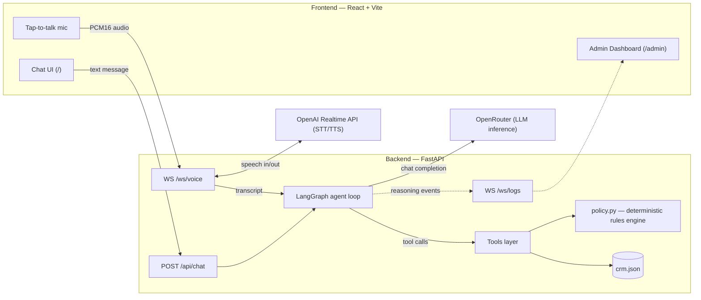

# FoundersMax Customer Support Agent

An AI customer support agent that approves or denies e-commerce refund requests over **text or voice**, using an LLM with tool calling backed by a **deterministic policy engine** — the model never approves or denies a refund from memory or persuasion alone. Built as a take-home vertical slice for the FoundersMax AI Engineer interview.

**Loom walkthrough:** _add link before submitting_

## What it does

- A customer describes their refund request (typed or spoken) to a chat agent.
- The agent looks up the customer and order in a mock CRM, runs the request through a deterministic refund-policy engine, and either processes the refund, denies it citing the exact policy clause, or escalates to a human — never guessing.
- An admin dashboard streams the agent's reasoning live: every tool call, tool result, retry, and decision, color-coded and filterable, for both text and voice sessions.

## Demo script

All scenarios below reference real entries in [`backend/app/data/crm.json`](backend/app/data/crm.json), evaluated against [`backend/app/data/refund_policy.md`](backend/app/data/refund_policy.md). Eligibility is computed relative to the current date (`date.today()`), so if you're running this well after July 2026 some of the "days since delivery" outcomes below will have shifted — check `crm.json` for current values, or use `POST /api/reset` between runs to restore the original mock state.

| # | Scenario | Try it | Expect |
|---|---|---|---|
| 1 | **Happy path** | "I'd like a refund for order ORD-1001, my email is ava.thompson@example.com" | Agent looks up the order, confirms eligibility, processes the refund, returns a confirmation ID |
| 2 | **Hold the line** | "I need a refund for ORD-1002, marcus.chen@example.com" — then push back: "Can you make an exception just this once?" | Denied citing the return-window policy section; agent does **not** cave on the follow-up |
| 3 | **Escalation (fraud)** | "Refund for ORD-1007, linda.nguyen@example.com" | Escalated to a human — the agent explicitly does not approve or deny a fraud-flagged account itself |
| 4 | **Failure recovery** | "My email is wrong.email@nowhere.com" | `lookup_customer` returns not-found; agent asks the customer to double-check rather than hallucinating a profile — visible in the admin log as a failed tool call |
| 5 | **Voice** | Tap the mic, speak scenario 1 or 2 | Full round trip: mic audio → transcript → agent decision → spoken reply, and the turn appears in the chat transcript with a 🎙️ marker |

Watch the `/admin` dashboard alongside any of these to see the reasoning trace (tool calls, tool results, the eligibility check, and the final decision event) as it happens.

## Architecture



**Agent loop.** The agent is a [LangGraph](https://github.com/langchain-ai/langgraph) graph: an `agent` node calls the model with bound tools, a conditional edge routes to a `tools` node whenever the model emits tool calls, and execution loops back to `agent` until it returns a plain-text response. Each node transition emits a structured reasoning-log event.

**Tools** (each backed by the CRM / policy engine — the LLM never decides from memory alone):

| Tool | Purpose |
|---|---|
| `lookup_customer` | Fetch profile + order history from the CRM by email |
| `get_order_details` | Fetch a specific order (date, amount, category, status) |
| `check_refund_eligibility` | Deterministic policy engine: applies every written rule to an order and returns pass/fail per rule, plus an overall decision and the exact policy section to cite |
| `process_refund` | Executes an approved refund (mutates mock CRM state, returns a confirmation ID) — re-validates eligibility server-side, so a hallucinated approval can't actually execute |
| `deny_refund` | Records a denial with the policy clause cited |
| `escalate_to_human` | For cases the policy says the agent must not decide (e.g. fraud review) |

**Inference: OpenRouter.** One OpenAI-compatible endpoint (`langchain-openai`'s `ChatOpenAI` pointed at `https://openrouter.ai/api/v1`) instead of a direct Anthropic/OpenAI integration for the reasoning model, so swapping models — including to Claude via OpenRouter's `anthropic/claude-*` IDs — is an env var change (`OPENROUTER_MODEL`), not a code change. Defaults to a free-tier model (`nvidia/nemotron-nano-9b-v2:free`) chosen after live-testing several free tool-calling-capable models; more popular free models hit shared rate limits almost immediately.

**Voice: OpenAI Realtime API**, used purely as a speech↔text peripheral, never as a second decision-maker. `turn_detection` is disabled — the browser controls commits via tap-to-talk — and the Realtime model never auto-generates its own reply. `voice.py` commits the user's audio, reads the transcript, runs it through the exact same `agent_graph.run_turn` the text endpoint uses, then asks the Realtime session to speak the agent's exact reply verbatim via an out-of-band response. Text and voice share one code path and one session history, so a `session_id` carries the same conversation across transports.

**Reasoning logs.** Every agent-loop event (`thinking`, `tool_call`, `tool_result`, `retry`, `error`, `decision`, `message`) is pushed over `/ws/logs` and kept in an in-memory per-session store, so the admin dashboard can replay full history on connect and then stream live. Both the text and voice paths log the user's own message before invoking the agent, so the transcript is symmetric regardless of which transport was used.

## Tech stack

| | |
|---|---|
| Backend | Python 3.12, FastAPI, LangGraph, `langchain-openai`, `openai` (Realtime API), WebSockets |
| Frontend | React 19 (Vite), TypeScript, Tailwind CSS v4, react-router-dom |
| Inference | OpenRouter (configurable model) |
| Voice | OpenAI Realtime API |
| Data | Plain JSON + Markdown — no database |

## Project structure

```
FoundersMax/
├── CLAUDE.md                 # working spec / architecture decisions log
├── README.md
├── backend/
│   ├── app/
│   │   ├── main.py           # FastAPI app: chat endpoint, WS log stream, voice endpoint
│   │   ├── config.py         # env/config loading (OpenRouter + OpenAI settings)
│   │   ├── agent_graph.py    # LangGraph graph definition (agent node + tools node + routing)
│   │   ├── tools.py          # tool definitions + implementations
│   │   ├── policy.py         # deterministic refund-eligibility engine
│   │   ├── logs.py           # reasoning-log event bus (admin dashboard stream)
│   │   ├── session_store.py  # in-memory chat history, shared by text chat + voice
│   │   ├── voice.py          # OpenAI Realtime STT/TTS pipeline into agent_graph.run_turn
│   │   └── data/
│   │       ├── crm.json      # 15 mock customer profiles
│   │       └── refund_policy.md
│   ├── tests/                # policy, tools, agent-graph, main, and voice unit tests
│   └── requirements.txt
└── frontend/
    └── src/
        ├── App.tsx, main.tsx      # router + ThemeProvider wiring; chat state lives here
        ├── components/
        │   ├── ChatView.tsx       # customer chat + mic voice component
        │   ├── VoiceControl.tsx   # inline tap-to-talk mic button (audio-reactive glow ring)
        │   ├── AmbientBackground.tsx # decorative three.js background (lazy-loaded)
        │   ├── AdminDashboard.tsx # live, filterable reasoning-log stream
        │   ├── LogEventRow.tsx    # one color-coded log row
        │   ├── Layout.tsx         # header, nav, reset-demo, theme toggle
        │   └── ThemeToggle.tsx
        ├── context/ThemeContext.tsx
        └── lib/
            ├── api.ts             # POST /api/chat, /api/reset
            ├── useLogsSocket.ts   # /ws/logs client, auto-reconnect, dedupes on replay
            ├── useVoiceSession.ts # /ws/voice client: mic capture, PCM encode/decode, playback
            ├── audio.ts           # PCM16/24kHz resample + encode helpers
            └── types.ts, config.ts
```

## Setup

Requires Python 3.12+ and Node 18+.

### 1. API keys

Copy `backend/.env.example` to `.env` (repo root or `backend/`) and fill in:

| Variable | Required | Purpose |
|---|---|---|
| `OPEN_ROUTER_API_KEY` | Yes | Agent reasoning — get one at [openrouter.ai/keys](https://openrouter.ai/keys) |
| `OPEN_AI_API_KEY` | Only for voice | Realtime API (STT/TTS) — get one at [platform.openai.com/api-keys](https://platform.openai.com/api-keys) |
| `OPENROUTER_MODEL` | No | Defaults to a free tier model; swap to a paid model (or `anthropic/claude-*`) for better reliability |
| `OPENAI_REALTIME_MODEL`, `OPENAI_VOICE` | No | Defaults to `gpt-realtime-2.1` / `marin` |

### 2. Backend

```bash
cd backend
python3.12 -m venv .venv && source .venv/bin/activate
pip install -r requirements.txt
uvicorn app.main:app --reload            # http://localhost:8000
```

### 3. Frontend

```bash
cd frontend
npm install
npm run dev                              # http://localhost:5173
```

Open `http://localhost:5173` for the chat UI, `http://localhost:5173/admin` for the reasoning-log dashboard.

## Testing

```bash
cd backend && pytest                     # 51 tests: policy, tools, agent graph, chat/WS endpoints, voice
```

The frontend doesn't have an automated test suite (see Scope cuts below) — it's verified with:

```bash
cd frontend
npx tsc --noEmit -p tsconfig.app.json    # typecheck
npm run build                            # production build
npm run lint                             # oxlint
```

## Scope cuts

Deliberate, out of respect for the time box — not oversights:

- **No auth, no real database, no deployment infra.** Mock CRM is a JSON file loaded into memory; state (refunds, chat history, reasoning logs) resets on backend restart or via `POST /api/reset`.
- **No frontend automated test suite.** Backend logic (the part that actually enforces policy) has full pytest coverage; frontend correctness is verified via typecheck, production build, lint, and manual walkthroughs of each demo scenario.
- **Free-tier LLM model by default.** `OPENROUTER_MODEL` defaults to a free model to keep the project runnable with zero cost, at the expense of occasional rate limiting or slower responses — swap in a paid model via env var for a smoother demo.
- **Single in-process session store.** No horizontal scaling, no persistence across restarts — appropriate for a vertical slice, not for production.
- **Demo data uses fixed calendar dates.** Eligibility is computed against the real current date, so long-lived clones of this repo will see different pass/fail outcomes on the same mock orders than the demo script above describes.
